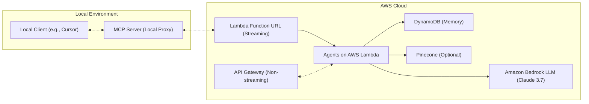

# Serverless Agent Pattern

This project demonstrates a serverless AI multi-agent architecture using [Mastra](https://github.com/mastra-ai/mastra), featuring streaming responses via IAM-secured Lambda Function URLs, agent-to-agent communication with a local agent through MCP (Model Context Protocol), persistent memory with DynamoDB, and vector storage with Pinecone.

## ✨ Key Feature: Agent-to-Agent Communication via MCP

This project showcases a powerful integration pattern using the Model Context Protocol (MCP) to enable agent-to-agent communication from your local MCP-compatible coding agent (e.g. Cursor) with a network of remote agents. MCP is an open protocol that enables seamless integration between LLM applications and external data sources and tools. You can find the full specification at [modelcontextprotocol.io/specification/2025-03-26](https://modelcontextprotocol.io/specification/2025-03-26).

The implementation:

- Creates a thin local MCP server that acts as a proxy to remote Mastra agents
- Enables direct communication between local AI agents (like Cursor) and deployed cloud agents
- Uses Lambda Function URLs for streaming responses, supporting large responses (up to 20MB soft) and long-running response streams (up to 15 minutes)
- Demonstrates how to bridge local development tools with production AI services using standardized protocols

See the [MCP Server section](#mcp-server) for detailed setup and usage instructions.

## Architecture

This project implements a serverless AI agent architecture with the following components:



Key components:

- **Local Client**: MCP-compatible tools like Cursor that use the remote agent capabilities
- **MCP Server**: Local proxy that translates MCP requests to Lambda invocations
- **Lambda Function URL**: Provides streaming responses for improved interactivity
- **API Gateway**: Alternative non-streaming endpoint with IAM authentication
- **AWS Lambda**: Runs the Mastra agent framework with specialized AWS service tools
- **DynamoDB**: Stores conversation memory and agent state
- **Pinecone**: Optional vector storage for semantic search capabilities
- **Amazon Bedrock**: Provides the LLM capabilities through Claude 3.7 Sonnet

## Project Structure

```
serverless-agent-pattern/
├── src/
│   ├── cdk/         # AWS CDK infrastructure definition
│   │   ├── bin/     # CDK application entry point
│   │   └── lib/     # CDK stack definition (PocMastraLambdaStack)
│   ├── lambda/      # Lambda function handler code
│   │   └── index.ts
│   ├── mcp-server/  # MCP server implementation for remote agent proxy
│   │   └── index.ts # MCP server entry point
│   └── lib/         # Mastra agent and tool definitions
│       ├── agents/
│       ├── tools/
│       └── index.ts # Mastra initialization
├── .env.development # Example environment variables (gitignored)
├── .gitignore
├── cdk.json         # CDK configuration
├── eslint.config.cjs # ESLint configuration
├── package.json     # Project dependencies and scripts
├── pnpm-lock.yaml
└── tsconfig.json    # TypeScript configuration
```

## Prerequisites

- Node.js (v22.x recommended)
- PNPM (`npm install -g pnpm`)
- AWS Account
- AWS CLI configured with credentials (`aws configure`)
- AWS Bedrock foundation model access. The specific models utilized by this project are defined within the CDK stack in `src/cdk/lib/serverless-agent-stack.ts`. You will need access to these models in your AWS account. See the general guide here: https://docs.aws.amazon.com/bedrock/latest/userguide/model-access.html
- AWS CDK bootstrapped (`cdk bootstrap`)
- AWS Secrets Manager secrets created in your target region:
  - `pinecone/api-key`: (Optional) Your Pinecone API key (only required if Pinecone vector search is enabled; see below).
- **`cdk.json` Configuration**: Ensure the following configurations are correctly set in your `cdk.json` file:
  - **Access Control**: Define role ARNs in `context.accessArns` to restrict access to the Lambda Function URL and API Gateway. These are interpolated with the current AWS account ID during deployment.
    ```json
    {
      "context": {
        "accessArns": ["YOUR ARN HERE", "YOUR OTHER ARN HERE"]
      }
    }
    ```
  - **Lambda Layer**: Specify the ARN for the libsql client library Lambda layer in `context.libsqlLayerArn`. (Note: This layer is temporarily required due to a Mastra bug, see [libsql-client-ts#112](https://github.com/mastra-ai/mastra/issues/4135)).
    ```json
    {
      "context": {
        "libsqlLayerArn": "YOUR LIBSQL LAYER HERE"
      }
    }
    ```
  - **Pinecone Vector Search (Optional)**: Controlled by `context.enablePinecone` (boolean) and `context.pineconeSecretName` (string). If `enablePinecone` is `true`, the stack uses the Pinecone API key from the specified secret.
    ```json
      "context": {
        // ...
        "enablePinecone": false,
        "pineconeSecretName": "pinecone/api-key"
      }
    ```
  - **Bedrock Models**: Specify the Bedrock model identifiers in `context.bedrockModels`. Ensure you have access to these models in your AWS account.
    ```json
      "context": {
        // ...
        "bedrockModels": {
          "embeddingModel": "amazon.titan-embed-text-v2:0",
          "completionModel": "anthropic.claude-3-7-sonnet-20250219-v1:0"
        }
      }
    ```

## Installation and Deployment

1.  Clone the repository.
2.  Install dependencies:
    ```bash
    pnpm install
    ```
3.  Build
    ```bash
    pnpm build
    ```
4.  Deploy
    ```bash
    pnpm cdk deploy
    ```

## Configuration

### Access Control Configuration

The service uses role ARNs defined in `cdk.json` to restrict access to both the Lambda Function URL and API Gateway endpoint:

```json
{
  "context": {
    "accessArns": ["YOUR ARN HERE", "YOUR OTHER ARN HERE"]
  }
}
```

These patterns:

- Are automatically interpolated with the current AWS account ID during deployment
- Restrict access to specific role ARN patterns

### Lambda Layer Configuration

The service depends on a Lambda layer containing a libsql client library. The ARN for this layer is configured in `cdk.json`:

```json
{
  "context": {
    "libsqlLayerArn": "YOUR LIBSQL LAYER HERE"
  }
}
```

Note that this layer is NOT used but is temporarily required due to a bug in Mastra where libsql is referenced via imports even when it's not used. See [libsql-client-ts#112](https://github.com/mastra-ai/mastra/issues/4135) for more details.

### Pinecone Vector Search (Optional)

Pinecone vector search is **optional** and controlled by the `enablePinecone` and `pineconeSecretName` context values in `cdk.json`:

```json
  "context": {
    ...
    "enablePinecone": false,
    "pineconeSecretName": "pinecone/api-key"
  }
```

- If `enablePinecone` is `true`, the stack will read the Pinecone API key from the configured `pineconeSecretName` context value, grant Lambda permissions to read it, and enable vector search in the agents.
- If `enablePinecone` is `false` (default), the Pinecone secret and permissions are not provisioned, and vector search is disabled. The agents will function with DynamoDB memory only.

### Bedrock Models Configuration

The project uses Amazon Bedrock foundation models that are specified in the `bedrockModels` context in `cdk.json`:

```json
  "context": {
    ...
    "bedrockModels": {
      "embeddingModel": "amazon.titan-embed-text-v2:0",
      "completionModel": "anthropic.claude-3-7-sonnet-20250219-v1:0"
    }
  }
```

You can modify these model identifiers if you want to use different Bedrock models. Just make sure you have appropriate access to the models in your AWS account before deploying.

## Deployment

This project uses AWS CDK to define and deploy the infrastructure.

1.  **Synthesize CloudFormation Template (Optional):**
    ```bash
    pnpm cdk synth
    ```
2.  **Deploy the Stack:**

    ```bash
    pnpm cdk deploy
    ```

    This command will provision:

    - A DynamoDB table per agent memory (can share fewer instances across agents as an alternative if you prefer)
    - A Node.js 22.x Lambda function with buffered response behind an API Gateway REST API with a `/chat` resource (POST method) for the buffered Lambda secured with IAM authentication.
    - A Node.js 22.x Lambda function with streaming response behind a streaming function URL secured with IAM authentication.
    - Necessary permissions.

    The deployment output will include the API Gateway endpoint URL and streaming function URL.

## Usage

You can interact with the deployed agents in a few ways:

1. **Local MCP Server** - [This](#mcp-server) provides a local MCP-compatible interface to the remote agent. Your local agent will use the remote agents for any of the capabilities that they support. The available backend agents include:
   - **CloudFormation Agent**: For querying and understanding AWS CloudFormation stacks, resources, deployments, and events.
   - **AWS CodePipeline Agent**: For read-only access to AWS CodePipeline pipelines, providing information on structure, status, and execution history.
   - **AWS CloudWatch Logs Agent**: For finding CloudWatch Log Groups and retrieving log events.
   - **AWS Lambda Agent**: For finding Lambda functions and retrieving their configuration details.
   - **DynamoDB Agent**: For finding and describing DynamoDB tables and their configurations.
   - **S3 Agent**: For managing S3 buckets and objects, including finding buckets, listing objects, and getting content.
   - **AWS Agent (Unified)**: A comprehensive agent combining capabilities of all specialized AWS agents.
   - **AWS Agent Network**: Coordinates specialized AWS agents to solve complex problems spanning multiple services.
2. **pnpm chat** - This will start a terminal UI that lets you chat with the deployed agents. It defaults to a REPL but supports a `--query` option for useful one-shot programmatic queries.

```bash
pnpm chat

> serverless-agent-pattern@1.0.0 chat /Users/imcd/Dev/serverless-agent-pattern
> pnpx tsx scripts/interactive-chat.ts

--- Starting Interactive Chat ---

Session Information:
Session ID: chat-1747616836147
Current Agent: awsAgent
Streaming Mode: Enabled
  Streaming Function URL: https://YOUR_FUNCTION_URL.lambda-url.us-east-1.on.aws/
Region: us-east-1
Profile: default
---
(Use --session-id chat-1747616836147 to resume later.)
Type /help for available commands.
You: hi
Agent (awsAgent):
Hello! I'm your AWS assistant. I can help you with various AWS services including:

- S3 buckets (listing, finding, exploring contents)
- CloudFormation stacks (finding, describing, checking resources and events)
- CodePipelines (finding, checking status, viewing execution history)
- CloudWatch Logs (finding log groups, retrieving log events)
- DynamoDB tables (finding, describing)
- Lambda functions (finding, viewing configurations)

How can I help you with your AWS resources today? If you have a specific service or resource you'd like to explore, please let me know.

---
You: what lambdas are in the serverless agent stack
Agent (awsAgent):
I'll help you find Lambda functions in the serverless agent stack. First, let me find the CloudFormation stack that matches your description, and then I'll list the Lambda resources in that stack.

I found a stack named "ServerlessAgentPatternStack" that matches your query. Now, let me list the Lambda resources in this stack:

I found 2 Lambda functions in the ServerlessAgentPatternStack:

1. **ServerlessAgentPatternBufferedLambda50A79D9B**
   - Physical ID: ServerlessAgentPatternSta-ServerlessAgentPatternBu-8HtI4t102V14
   - Status: CREATE_COMPLETE

2. **ServerlessAgentPatternStreamingLambda10CD1640**
   - Physical ID: ServerlessAgentPatternSta-ServerlessAgentPatternSt-Jo44fJOxpbdL
   - Status: CREATE_COMPLETE

These are the Lambda functions that are part of the ServerlessAgentPatternStack. Would you like me to get more detailed configuration information about either of these Lambda functions?

---
You: what are the memory settings on those?
Agent (awsAgent):
I'll check the memory settings for both Lambda functions in the ServerlessAgentPatternStack. Let
>

Here are the memory settings for both Lambda functions:

1. **ServerlessAgentPatternBufferedLambda (ServerlessAgentPatternSta-ServerlessAgentPatternBu-8HtI4t102V14)**:
   - Memory Size: **512 MB**
   - Timeout: 45 seconds
   - Ephemeral Storage:512 MB

2. **ServerlessAgentPatternStreamingLambda (ServerlessAgentPatternSta-ServerlessAgentPatternSt-Jo44fJOxpbdL)**:
   - Memory Size: **512 MB**
   - Timeout: 300 seconds (5 minutes)
   - Ephemeral Storage: 512 MB

Both Lambda functions are configured with the same memory allocation of 512 MB, though they have different timeout settings. The streaming Lambda has a significantly longer timeout (5 minutes) compared to the buffered Lambda (45 seconds).

---
```

Under the hood, the agents are served via either:

1. **Streaming Lambda Function URL (default)** - This supports streaming responses for a more interactive experience, with max 20MB response size and 15 minute timeout.
2. **API Gateway endpoint** - This provides standard request/response functionality.

Access to both endpoints is managed via the [Access Control Configuration](#access-control-configuration).

### MCP Server

The project includes an MCP server implementation that acts as a proxy to the remote agent. This allows you to interact with the deployed agent function using MCP-compatible tools and interfaces. The server uses Lambda Function URLs for streaming responses, which supports responses up to 20MB and timeouts up to 15 minutes.

**Setting up the MCP Server:**

1. First, build the MCP server:

   ```bash
   pnpm run build
   ```

2. Add the following configuration to your `~/.cursor/mcp.json` file (create it if it doesn't exist):
   ```json
   {
     "mcpServers": {
       "remote-agent-proxy": {
         "command": "node",
         "args": ["<ABSOLUTE_PATH_TO_WORKSPACE>/dist/mcp-server/index.js"],
         "env": {
           // Optional profile override. Otherwise the default credential provider chain is used.
           "AWS_PROFILE": "YOUR ALTERNATE AWS PROFILE HERE"
         }
       }
     }
   }
   ```
   Replace `<ABSOLUTE_PATH_TO_WORKSPACE>` with the absolute path to your cloned repository.

The MCP server provides a single tool called `remoteAgentProxy` that forwards requests to the deployed Lambda function. It uses Lambda Function URLs with streaming responses to support large responses and long-running requests. Once configured, the server will be automatically started when needed by MCP-compatible tools.

Your local Cursor agent dynamically selects the agent to ask.

Cursor uses the agents like any other tool, making consecutive calls if you allow that in your Cursor configuration.


Opening the tool call drop-down shows the underlying response from the remote agent in the Result. Note that, while the tool call is executing, the result will be empty because it will not display the live stream from the agent until the complete response is received.

**Configuration Options:**

The server supports the following configuration:

- AWS credentials from specified profile in `mcp.json` or override with `AWS_PROFILE` environment variable. Defaults to profile `default`.
- Default region (us-east-1) or override with `AWS_REGION`

**Available Tool Parameters:**

The `remoteAgentProxy` tool accepts the following parameters:

- `query` (required): The message to send to the remote agent
- `agent`: The target agent name. Valid options: `awsAgent`, `cloudformationAgent`, `codepipelineAgent`, `cloudwatchLogsAgent`, `lambdaAgent`, `dynamodbAgent`, `s3Agent`, `awsAgentNetwork`. Defaults to `awsAgent`. It is recommended to explicitly specify the agent for clarity.
- `profile`: AWS profile to use

The tool uses Lambda Function URLs with streaming responses to support large responses and long-running requests.

### Lambda Function URL (With Streaming Support)

The function URL provides a direct endpoint to the Lambda with streaming response capabilities. This is the default mode used by the `chat` script. It's useful for chat interfaces that need to display responses as they're generated.

- **Endpoint:** The function URL displayed in the CloudFormation output when you deploy the stack
- **Authentication:** AWS IAM Authentication. The function URL requires valid AWS credentials to access.
  - **Access Control:** Access is restricted to IAM roles matching the patterns configured in `cdk.json`'s `accessArns`. Only principals with matching role ARNs can invoke the function.
- **Request Body:** Same format as the API Gateway endpoint
  ```json
  {
    "query": "What are you capable of?",
    "threadId": "some-session-id",
    "resourceId": "some-session-id"
  }
  ```
- **Response Format:** text/plain stream with complete response data

**Using the `chat` script with streaming:**

```bash
# Streaming is the default, so just run:
pnpm chat

# To explicitly disable streaming and use API Gateway:
pnpm chat --streaming false
```

## Security Considerations

### IAM Permissions

This project grants various IAM permissions to enable the agent functionality:

- **CloudFormation**: Read-only access to CloudFormation resources
- **S3**: Read access to all buckets plus write permissions (`s3:PutObject`) for storing data
- **CloudWatch Logs**: Read-only access to log groups and log events
- **CodePipeline**: Read-only access to pipeline configurations and execution history
- **Lambda**: Read-only access to function configurations
- **DynamoDB**: Read-only access to table listings and descriptions, plus read/write to agent memory tables

**Important**: While these permissions are suitable for exploration and development, you should apply the principle of least privilege in production environments by scoping permissions to specific resources where possible.

## Troubleshooting

Here are solutions to common issues:

- **Access denied to Lambda Function URL or API Gateway**:

  - Ensure your AWS credentials have the correct IAM role that matches the pattern in `cdk.json` → `accessArns`
  - For CLI tools, verify your AWS profile is correctly set
  - If you changed `accessArns` in `cdk.json`, redeploy the stack

- **"LibSQL not found" error**:

  - Verify the `libsqlLayerArn` in `cdk.json` is correct for your deployment region
  - If deploying to a region other than `us-east-1`, you'll need to create your own Lambda layer with libsql

- **AWS Bedrock model errors**:

  - Ensure you have requested and been granted access to the Bedrock models (Amazon Titan and Claude 3.7 Sonnet)
  - Visit AWS console → Bedrock → Model Access to verify access status

- **Pinecone errors (if enabled)**:
  - Verify you've created a secret named `pinecone/api-key` in AWS Secrets Manager with your Pinecone API key
  - Ensure both `enablePinecone` and `pineconeSecretName` are correctly set in `cdk.json`

## Contributing

We welcome contributions! Please see our [CONTRIBUTING.md](CONTRIBUTING.md) for guidelines on how to contribute to this project.

## License

This project is licensed under the MIT License. See the [LICENSE](LICENSE) file for details.
